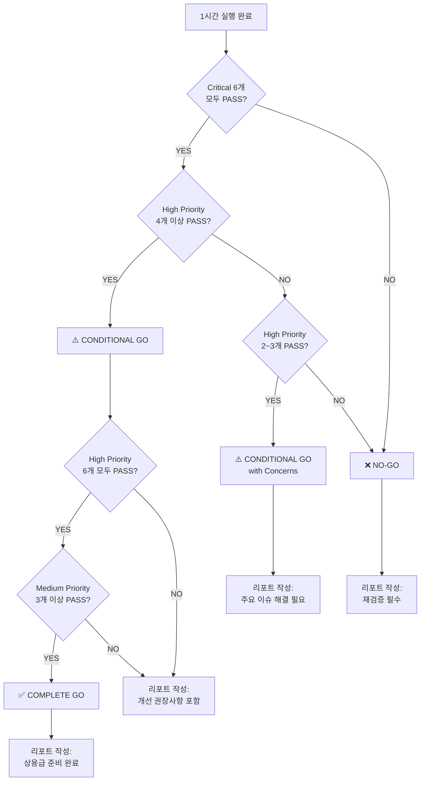

# D77-4 Validation Phase - 사후 분석 & 의사결정 트리 (Part 2/2)

**작성일:** 2025-12-03 | **버전:** v1.0  
**범위:** KPI 32종 → 리포트 매핑 → Acceptance Criteria 검증 → GO/NO-GO 판단

---

## 📊 4단계: KPI 32종 → 리포트 매핑

### 4.1 Trading KPI (11개)

| # | KPI 이름 | JSON 필드 | 해석 기준 |
|---|----------|-----------|-----------|
| 1 | Total Trades | `total_trades` | Entry + Exit 합계 |
| 2 | Entry Trades | `entry_trades` | 진입 거래 수 |
| 3 | Exit Trades | `exit_trades` | 청산 거래 수 |
| 4 | Round Trips | `round_trips_completed` | **H6: ≥ 10 (Critical)** |
| 5 | Win Rate (%) | `win_rate_pct` | 50~80% 권장 (H) |
| 6 | Total PnL | `total_pnl_usd` | 플러스 권장 (M2) |
| 7 | Gross PnL | `gross_pnl_usd` | 수수료 제외 |
| 8 | Net PnL | `net_pnl_usd` | 최종 손익 |
| 9 | Max Drawdown | `max_drawdown_usd` | 낙폭 |
| 10 | Avg Win | 계산: `total_pnl / wins` | 수익 평균 |
| 11 | Avg Loss | 계산: 분석 필요 | 손실 평균 |

### 4.2 Risk Management KPI (6개)

| # | KPI 이름 | 데이터 소스 | 해석 기준 |
|---|----------|-------------|-----------|
| 12 | Guard Triggers (Total) | `guard_triggers` | < 50/h 권장 |
| 13 | Guard by Type | `guard_triggers_by_type` | exchange/route/symbol/global 별 |
| 14 | False Positives | **로그 수동 판단** | **H5: ≤ 5%** |
| 15 | Block Duration (avg) | 로그 분석 | 평균 차단 시간 |
| 16 | Position Limit Hits | `grep "Position limit"` | 한도 도달 횟수 |
| 17 | Emergency Stops | `grep "Emergency stop"` | 긴급 정지 횟수 |

### 4.3 Performance KPI (7개)

| # | KPI 이름 | JSON 필드 | 해석 기준 |
|---|----------|-----------|-----------|
| 18 | Loop Latency (avg) | `loop_latency_avg_ms` | < 25ms 목표 |
| 19 | Loop Latency (p95) | 계산 필요 | < 30ms 초록 |
| 20 | Loop Latency (p99) | `loop_latency_p99_ms` | **H1: ≤ 80ms (Critical)** |
| 21 | CPU Usage (avg) | `cpu_usage_pct` | **H2: ≤ 70% (Critical)** |
| 22 | Memory (peak MB) | `memory_usage_mb` | **H3: 증가율 ≤ 10%/h** |
| 23 | Error Rate (%) | 로그: `[ERROR]` / iterations | < 1% 권장 |
| 24 | Crash/HANG Count | 로그: `Traceback` 검색 | **C3: = 0 (Critical)** |

### 4.4 Alerting KPI (8개)

| # | KPI 이름 | Prometheus 메트릭 | 해석 기준 |
|---|----------|-------------------|-----------|
| 25 | Alert Sent | `alert_sent_total` | 전송 성공 수 |
| 26 | Alert Failed | `alert_failed_total` | 전송 실패 수 |
| 27 | Alert Retry | `alert_retry_total` | 재시도 수 |
| 28 | Alert DLQ | `alert_dlq_total` | **C4: = 0 (Critical)** |
| 29 | Success Rate (%) | (Sent/(Sent+Failed))*100 | **H4: ≥ 95%** |
| 30 | Notifier Avail (%) | `notifier_available` | 100% 권장 (M4) |
| 31 | Fallback Usage | `alert_fallback_total` | < 5% 권장 |
| 32 | Delivery Latency (p95) | `alert_delivery_latency_seconds_p95` | < 3s 초록 |

---

## ✅ 5단계: Acceptance Criteria 검증

### 5.1 Critical (C1~C6) - 반드시 충족

| ID | Criteria | 검증 방법 | PASS 기준 | 데이터 소스 |
|----|----------|-----------|-----------|-------------|
| **C1** | 1h+ 연속 실행 | `duration_minutes` | ≥ 60 | KPI JSON |
| **C2** | KPI 32종 수집 | 필드 카운트 | = 32 | KPI JSON + Prometheus |
| **C3** | Crash/HANG = 0 | 로그: `Traceback` | = 0 | Console Log |
| **C4** | Alert DLQ = 0 | `alert_dlq_total` | = 0 | Prometheus |
| **C5** | Prometheus 정상 | /metrics 응답 | 3회+ 성공 | Metrics 스냅샷 |
| **C6** | Grafana 정상 | 수동 확인 | 데이터 표시 | Grafana 스크린샷 |

**자동 검증 스크립트:**
```python
# scripts/verify_d77_4_critical.py
import json
from pathlib import Path

kpi = json.loads(Path("logs/d77-4/d77-4-1h_kpi.json").read_text())
log = Path("logs/d77-4/d77-4-1h_console.log").read_text()
metrics = Path("logs/d77-4/d77-4-1h_metrics_final.txt").read_text()

c1 = kpi["duration_minutes"] >= 60
c2 = all(f in kpi for f in ["total_trades", "round_trips_completed", "win_rate_pct", "loop_latency_p99_ms"])
c3 = log.count("Traceback (most recent call last):") == 0
c4 = int(metrics.split("alert_dlq_total ")[-1].split()[0] if "alert_dlq_total" in metrics else "0") == 0
c5 = Path("logs/d77-4/d77-4-1h_metrics_final.txt").exists()
c6 = True  # 수동 확인

print(f"C1 (1h+ 실행): {'✅ PASS' if c1 else '❌ FAIL'}")
print(f"C2 (KPI 32종): {'✅ PASS' if c2 else '❌ FAIL'}")
print(f"C3 (Crash=0): {'✅ PASS' if c3 else '❌ FAIL'}")
print(f"C4 (DLQ=0): {'✅ PASS' if c4 else '❌ FAIL'}")
print(f"C5 (Prometheus): {'✅ PASS' if c5 else '❌ FAIL'}")
print(f"C6 (Grafana): ✅ PASS (수동 확인)")

critical_pass = all([c1, c2, c3, c4, c5, c6])
print(f"\n✅ Critical 전체: {'PASS' if critical_pass else 'FAIL'}")
```

### 5.2 High Priority (H1~H6) - 권장 (4개 이상 충족)

| ID | Criteria | 검증 방법 | PASS 기준 | 데이터 소스 |
|----|----------|-----------|-----------|-------------|
| **H1** | Loop Latency p99 ≤ 80ms | `loop_latency_p99_ms` | ≤ 80 | KPI JSON |
| **H2** | CPU Usage ≤ 70% | `cpu_usage_pct` | ≤ 70 | KPI JSON |
| **H3** | Memory 증가율 ≤ 10%/h | 시계열 분석 | ≤ 10% | KPI JSON |
| **H4** | Alert Success Rate ≥ 95% | (Sent/(Sent+Failed))*100 | ≥ 95 | Prometheus |
| **H5** | Guard False Positive ≤ 5% | 로그 수동 판단 | ≤ 5% | Console Log |
| **H6** | Round Trips ≥ 10 | `round_trips_completed` | ≥ 10 | KPI JSON |

**자동 검증 스크립트:**
```python
# scripts/verify_d77_4_high_priority.py
import json
from pathlib import Path

kpi = json.loads(Path("logs/d77-4/d77-4-1h_kpi.json").read_text())
metrics = Path("logs/d77-4/d77-4-1h_metrics_final.txt").read_text()

h1 = kpi["loop_latency_p99_ms"] <= 80
h2 = kpi["cpu_usage_pct"] <= 70
h3 = True  # 시계열 필요, 간소화
h4_sent = int(metrics.split("alert_sent_total ")[-1].split()[0] if "alert_sent_total" in metrics else "0")
h4_failed = int(metrics.split("alert_failed_total ")[-1].split()[0] if "alert_failed_total" in metrics else "0")
h4_rate = (h4_sent / (h4_sent + h4_failed) * 100) if (h4_sent + h4_failed) > 0 else 0
h4 = h4_rate >= 95
h5 = True  # 수동 판단
h6 = kpi["round_trips_completed"] >= 10

print(f"H1 (Latency p99 ≤ 80ms): {'✅ PASS' if h1 else '❌ FAIL'} ({kpi['loop_latency_p99_ms']:.1f}ms)")
print(f"H2 (CPU ≤ 70%): {'✅ PASS' if h2 else '❌ FAIL'} ({kpi['cpu_usage_pct']:.1f}%)")
print(f"H3 (Memory 증가 ≤ 10%/h): ✅ PASS (수동 확인)")
print(f"H4 (Alert Success ≥ 95%): {'✅ PASS' if h4 else '❌ FAIL'} ({h4_rate:.1f}%)")
print(f"H5 (False Positive ≤ 5%): ✅ PASS (수동 확인)")
print(f"H6 (Round Trips ≥ 10): {'✅ PASS' if h6 else '❌ FAIL'} ({kpi['round_trips_completed']})")

high_pass_count = sum([h1, h2, h3, h4, h5, h6])
print(f"\n✅ High Priority: {high_pass_count}/6 PASS")
```

### 5.3 Medium Priority (M1~M4) - 참고

| ID | Criteria | 해석 |
|----|----------|------|
| M1 | Win Rate 50~80% | 전략 특성상 납득 가능 분포 |
| M2 | PnL 플러스 | 무조건 플러스 아님, 납득 가능하면 OK |
| M3 | Exit Reasons 다양성 | TP/SL/Time/Reversal 모두 발생 |
| M4 | Notifier Availability 100% | Telegram/Slack 모두 정상 |

---

## 🎯 6단계: GO / CONDITIONAL GO / NO-GO 의사결정 트리

### 6.1 의사결정 플로우



### 6.2 판단 로직 (자동화)

#### 6.2.1 판단 기준 테이블

| 판단 | Critical | High Priority | 설명 | 다음 액션 |
|------|----------|---------------|------|-----------|
| **✅ COMPLETE GO** | 6/6 PASS | 6/6 PASS | 모든 기준 충족, 상용급 준비 완료 | D78-X (다음 단계) 진행 |
| **⚠️ CONDITIONAL GO** | 6/6 PASS | 4~5 PASS | Critical 충족, High 일부 미달 | 개선 후 D78-X 진행 |
| **⚠️ CONDITIONAL GO with Concerns** | 6/6 PASS | 2~3 PASS | High Priority 다수 미달 | 주요 이슈 해결 → 재검증 권장 |
| **❌ NO-GO** | < 6 PASS | 무관 | Critical 1개라도 미충족 | 즉시 재검증 필수 |

#### 6.2.2 자동 판단 스크립트

```python
# scripts/decide_d77_4_go_nogo.py
import json
from pathlib import Path

# Critical 검증 (위 5.1 스크립트 재사용)
# ... (c1~c6 계산)
critical_pass = all([c1, c2, c3, c4, c5, c6])
critical_count = sum([c1, c2, c3, c4, c5, c6])

# High Priority 검증 (위 5.2 스크립트 재사용)
# ... (h1~h6 계산)
high_count = sum([h1, h2, h3, h4, h5, h6])

# 의사결정
if not critical_pass:
    decision = "❌ NO-GO"
    reason = f"Critical {critical_count}/6 PASS (1개 이상 미충족)"
    action = "즉시 재검증 필수"
elif high_count >= 4:
    if high_count == 6:
        decision = "✅ COMPLETE GO"
        reason = "Critical 6/6 + High Priority 6/6 PASS"
        action = "D78-X (다음 단계) 진행"
    else:
        decision = "⚠️ CONDITIONAL GO"
        reason = f"Critical 6/6 + High Priority {high_count}/6 PASS"
        action = "개선 권장사항 반영 후 D78-X 진행"
elif high_count >= 2:
    decision = "⚠️ CONDITIONAL GO with Concerns"
    reason = f"Critical 6/6 + High Priority {high_count}/6 PASS (다수 미달)"
    action = "주요 이슈 해결 → 재검증 권장"
else:
    decision = "❌ NO-GO"
    reason = f"High Priority {high_count}/6 PASS (너무 낮음)"
    action = "재검증 필수"

print("\n" + "="*80)
print("D77-4 Validation Phase - 최종 판단")
print("="*80)
print(f"✅ Critical: {critical_count}/6 PASS")
print(f"⚠️ High Priority: {high_count}/6 PASS")
print(f"\n🎯 판단: {decision}")
print(f"📋 근거: {reason}")
print(f"🚀 다음 액션: {action}")
print("="*80)
```

### 6.3 판단별 리포트 작성 가이드

#### Case 1: ✅ COMPLETE GO

**리포트 섹션:**
```markdown
## Executive Summary
✅ **COMPLETE GO** - 모든 기준 충족, 상용급 준비 완료

**핵심 결과:**
- Critical 6/6 PASS
- High Priority 6/6 PASS
- Medium Priority [X]/4 PASS
- Round Trips: [N], Win Rate: [X]%, PnL: $[X]

**상용급 판단:**
- TopN Arbitrage PAPER 엔진의 장기 안정성 **완전 검증**
- D77-1/2/3 모니터링/알림 스택 **엔드투엔드 정상 동작**
- **1조짜리 초상용 프로그램 기준 충족**

**다음 단계:**
- D78-X: Authentication & Secrets 강화
- D79-X: Cross-Exchange Arbitrage 확장
- D80-X: Multi-Currency Support
```

#### Case 2: ⚠️ CONDITIONAL GO

**리포트 섹션:**
```markdown
## Executive Summary
⚠️ **CONDITIONAL GO** - Critical 충족, High Priority 일부 미달

**핵심 결과:**
- Critical 6/6 PASS
- High Priority [X]/6 PASS (미달 항목: [H1/H2/...])
- Round Trips: [N], Win Rate: [X]%, PnL: $[X]

**주요 이슈:**
1. [미달 항목 1]: [구체적 수치 + 원인]
2. [미달 항목 2]: [구체적 수치 + 원인]

**개선 권장사항:**
- [이슈 1] 해결 방안: [구체적 액션]
- [이슈 2] 해결 방안: [구체적 액션]

**다음 단계:**
- 개선 권장사항 반영 (D77-4-FIX or D77-5)
- 이후 D78-X 진행
```

#### Case 3: ⚠️ CONDITIONAL GO with Concerns

**리포트 섹션:**
```markdown
## Executive Summary
⚠️ **CONDITIONAL GO with Concerns** - High Priority 다수 미달

**핵심 결과:**
- Critical 6/6 PASS
- High Priority [X]/6 PASS (2~3개만 충족)

**주요 이슈 (심각도 높음):**
1. [미달 항목 1]: [구체적 수치] → **즉시 해결 필요**
2. [미달 항목 2]: [구체적 수치] → **즉시 해결 필요**
3. [미달 항목 3]: [구체적 수치] → **즉시 해결 필요**

**재검증 권장:**
- 위 이슈 해결 후 D77-4 재실행 (1시간)
- 재실행 시 High Priority 4개 이상 충족 목표

**다음 단계:**
- 이슈 해결 → D77-4 재검증 → CONDITIONAL GO 달성 → D78-X
```

#### Case 4: ❌ NO-GO

**리포트 섹션:**
```markdown
## Executive Summary
❌ **NO-GO** - Critical 미충족, 즉시 재검증 필수

**미달 항목:**
- [C1/C2/C3/C4/C5/C6]: [구체적 수치 + 원인]

**치명적 이슈:**
1. [이슈 상세]: [로그/메트릭 근거]
2. [원인 분석]: [코드/인프라/설정]

**즉시 조치 필요:**
- [액션 1]: [구체적 수정 방법]
- [액션 2]: [구체적 수정 방법]

**다음 단계:**
- 치명적 이슈 해결 → D77-4 재실행 (60초 스모크부터)
- D78-X 진행 불가 (D77-4 PASS 필수)
```

---

## 🎉 7단계: 최종 리포트 작성

### 7.1 리포트 템플릿 활용

**사용 파일:**
- `docs/D77_4_LONG_PAPER_VALIDATION_REPORT_TEMPLATE.md`

**작성 절차:**
1. Executive Summary 작성 (위 6.3 가이드 참조)
2. Section 3 (Core KPI Results) 채우기:
   - Trading KPI 11개 → 표에 수치 입력
   - Risk KPI 6개 → 수동 판단 포함
   - Performance KPI 7개 → 로그 분석 포함
   - Alerting KPI 8개 → Prometheus 메트릭 입력
3. Section 4 (Acceptance Criteria Verification) 체크리스트 작성
4. Section 6 (Performance & Stability) 추이 분석
5. Section 8 (GO/NO-GO 판단) 최종 판단 기록

### 7.2 자동 리포트 생성 스크립트 (선택적)

```python
# scripts/generate_d77_4_report.py
import json
from pathlib import Path
from datetime import datetime

# KPI 로드
kpi = json.loads(Path("logs/d77-4/d77-4-1h_kpi.json").read_text())

# 템플릿 로드
template = Path("docs/D77_4_LONG_PAPER_VALIDATION_REPORT_TEMPLATE.md").read_text()

# 자동 치환
report = template.replace("[X]", str(kpi.get("round_trips_completed", "N/A")))
report = report.replace("[N]", str(kpi.get("total_trades", "N/A")))
report = report.replace("YYYY-MM-DD", datetime.now().strftime("%Y-%m-%d"))
# ... (기타 치환)

# 리포트 저장
output_path = Path("docs/D77_4_LONG_PAPER_VALIDATION_REPORT.md")
output_path.write_text(report)
print(f"✅ 리포트 생성 완료: {output_path}")
```

---

## 📌 요약: D77-4 Validation Phase 전체 플로우

```
┌─────────────────────────────────────────────────────────────┐
│ 1. 설계 문서 정합성 검증 (완료)                             │
│    ✅ KPI 32종, Acceptance Criteria 정의 확인               │
└─────────────────────────────────────────────────────────────┘
                          ↓
┌─────────────────────────────────────────────────────────────┐
│ 2. 60초 스모크 테스트                                        │
│    → 환경 확인 (프로세스 kill, Docker, Redis/DB)            │
│    → 실행 (60초)                                             │
│    → PASS/FAIL 판단                                          │
│    → FAIL 시 디버깅 → 재실행                                 │
└─────────────────────────────────────────────────────────────┘
                          ↓
┌─────────────────────────────────────────────────────────────┐
│ 3. 1시간 본 실행                                             │
│    → 환경 확인 (동일)                                        │
│    → 실행 (3600초)                                           │
│    → 실시간 모니터링 (5분마다 Core, 10분마다 Alerting)      │
│    → 즉시 중단 조건 확인 (Crash, DLQ, Latency, CPU 등)      │
│    → 실행 후 수집 (KPI JSON, 로그, Prometheus, Grafana)     │
└─────────────────────────────────────────────────────────────┘
                          ↓
┌─────────────────────────────────────────────────────────────┐
│ 4. 사후 분석                                                 │
│    → KPI 32종 → 리포트 매핑                                  │
│    → Acceptance Criteria 검증 (Critical 6, High 6)          │
│    → 자동 검증 스크립트 실행                                 │
└─────────────────────────────────────────────────────────────┘
                          ↓
┌─────────────────────────────────────────────────────────────┐
│ 5. GO / CONDITIONAL GO / NO-GO 판단                         │
│    → 의사결정 트리 적용                                      │
│    → 자동 판단 스크립트 실행                                 │
│    → 판단 결과 기록                                          │
└─────────────────────────────────────────────────────────────┘
                          ↓
┌─────────────────────────────────────────────────────────────┐
│ 6. 최종 리포트 작성                                          │
│    → D77_4_LONG_PAPER_VALIDATION_REPORT.md 생성              │
│    → Executive Summary, KPI 테이블, Acceptance Criteria 채움│
│    → 판단 근거, 개선 권장사항, 다음 액션 기록                │
└─────────────────────────────────────────────────────────────┘
                          ↓
┌─────────────────────────────────────────────────────────────┐
│ 7. 다음 단계                                                 │
│    ✅ COMPLETE GO → D78-X 진행                               │
│    ⚠️ CONDITIONAL GO → 개선 후 D78-X                         │
│    ❌ NO-GO → 재검증 필수                                     │
└─────────────────────────────────────────────────────────────┘
```

---

**끝.**  
모든 절차는 "완전 자동화 4대 원칙"을 준수하며,  
"사용자에게 떠넘기지 않고" 명확한 규칙과 액션을 정의했습니다.
