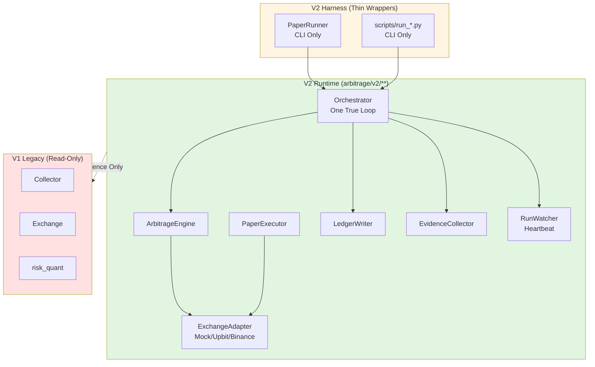
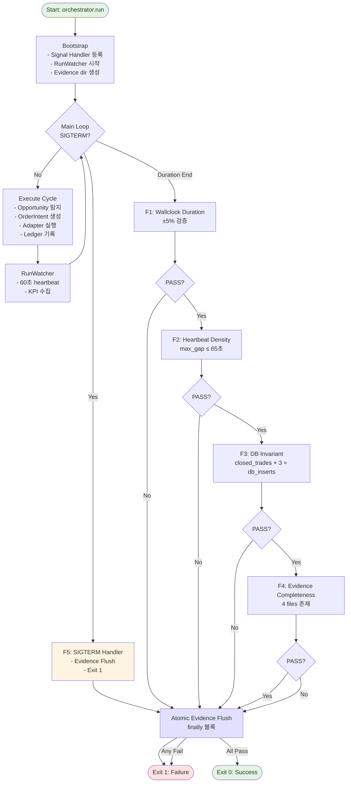
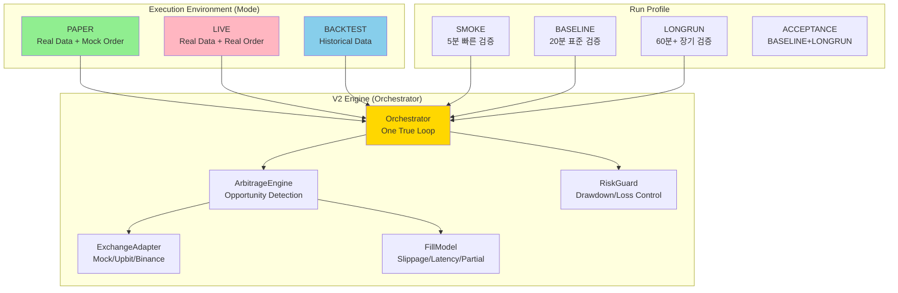
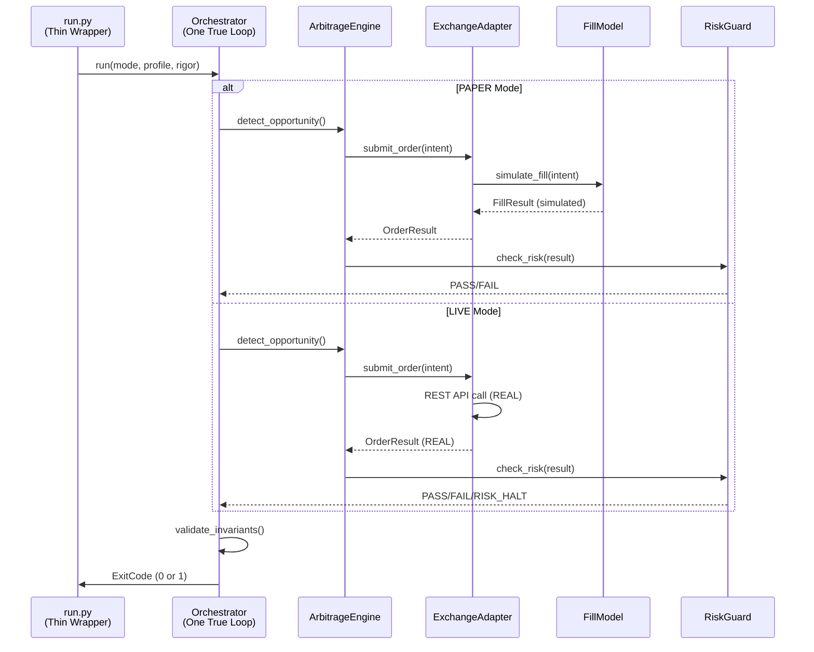

# V2 Architecture - Engine-Centric Flow

**Version:** 1.0  
**Status:** DESIGN  
**Owner:** V2 Team

---

## 🔒 SSOT & D-number Semantics

**⚠️ 중요:** 이 문서는 V2 아키텍처 설계 설명이며, **프로세스/상태의 유일 SSOT는 `D_ROADMAP.md`입니다.**

### D-number 불변 원칙 (Immutable Semantics)
- D 번호의 의미는 절대 변경 금지
- 추가 작업은 브랜치(Dxxx-y-z)로만 확장
- 예: D205-10 = "Intent Loss Fix" (고정), D205-10-0/1 = 브랜치

### SSOT 우선순위 (Hierarchy)

**`D_ROADMAP.md`가 유일 SSOT이며, 다른 문서는 참조/동기화 대상입니다.**

- **Process SSOT (최상위):** `D_ROADMAP.md`
  - D 번호 의미, 상태, AC, 증거 경로 정의
  - 충돌 시 D_ROADMAP이 우선

- **Rules SSOT:** `docs/v2/SSOT_RULES.md`
  - 개발 규칙 (D_ROADMAP 참조)

- **Map SSOT:** `docs/v2/design/SSOT_MAP.md`
  - 도메인별 SSOT 위치 (D_ROADMAP 참조)

- **Architecture SSOT (본 문서):** V2 설계 설명
  - 아키텍처 구조 (프로세스 SSOT와 동기화)

**SSOT 변경 규칙:** D_ROADMAP 수정 후 → SSOT_RULES/SSOT_MAP/V2_ARCHITECTURE 동기화

## Module Boundary & Migration Policy (SSOT)

- V2 실행 경로는 `arbitrage/v2/**` 이다.
- V1 (`arbitrage/**` legacy execution paths)는 참조/재사용 가능하나,
  V2 Runtime에서 실행 경로로 import 되는 것은 금지된다.

### Enforcement
- Boundary Guard는 모든 Gate / Paper / Live 실행 전에 자동 수행된다.
- V2 경로에서 V1 실행 모듈 import 발견 시 즉시 FAIL 한다.

### Migration Rule
- "사용 여부"의 판정 기준은 문서가 아니라 **Runtime import graph**이다.
- 사람이 기억하거나 수동으로 관리하지 않는다.


---

## 🎯 Design Goals (V2 아키텍처 설계 목표)

### 1. Engine-Centric (Not Script-Centric)
- ❌ **V1 Problem:** 65+ run_*.py scripts, 일회성 실험 난립
- ✅ **V2 Solution:** Single Engine + Adapter Pattern
- **Result:** 재사용성, 테스트 가능성 향상

### 2. Semantic Layer (Not Exchange-Specific)
- ❌ **V1 Problem:** 거래소별 payload 로직이 Runner에 혼재
- ✅ **V2 Solution:** OrderIntent → Adapter 분리
- **Result:** 의미(MARKET BUY) vs 구현(Upbit payload) 분리

### 3. Mock-First Testing
- ❌ **V1 Problem:** PAPER 모드도 실 API 호출 (느리고 불안정)
- ✅ **V2 Solution:** Mock/Stub Adapter로 로직 검증
- **Result:** 빠른 피드백, 실거래 리스크 제거

### 4. Infrastructure Parity (Cold Path + Hot Path)
- ❌ **V1 Problem:** PAPER 모드가 실제 인프라(DB/Redis) 없이 작동 가능
- ✅ **V2 Solution:** Paper/Live 모두 동일한 DB(Cold) + Redis(Hot) 인프라 필수
- **Result:** 실전 유사 검증, 배포 시 surprises 제거
  - **Cold Path (PostgreSQL):** Ledger/Truth, Audit, Replay source
  - **Hot Path (Redis):** Rate Limit counters, Dedup keys, Hot-state (Truth는 아님, 하지만 Runtime Required)

---

## 🏗️ Core Components

### 1. OrderIntent (Semantic Layer)

**Purpose:** 거래소 독립적인 주문 의도 표현

```python
from dataclasses import dataclass
from enum import Enum
from typing import Optional


class OrderSide(Enum):
    BUY = "BUY"
    SELL = "SELL"


class OrderType(Enum):
    MARKET = "MARKET"
    LIMIT = "LIMIT"


@dataclass
class OrderIntent:
    """
    거래소 독립적인 주문 의도.
    
    MARKET 주문 규약:
    - BUY MARKET: quote_amount 필수 (KRW/USDT 등 매수 금액)
    - SELL MARKET: base_qty 필수 (BTC/ETH 등 매도 수량)
    """
    exchange: str               # "upbit", "binance" 등
    symbol: str                 # "BTC/KRW", "BTC/USDT" 등
    side: OrderSide             # BUY or SELL
    order_type: OrderType       # MARKET or LIMIT
    
    # MARKET 주문 파라미터
    base_qty: Optional[float] = None      # SELL MARKET 시 필수
    quote_amount: Optional[float] = None  # BUY MARKET 시 필수
    
    # LIMIT 주문 파라미터
    limit_price: Optional[float] = None   # LIMIT 시 필수
    
    # 메타데이터
    route_id: Optional[str] = None
    strategy_id: Optional[str] = None
    
    def validate(self):
        """의도의 유효성 검증"""
        if self.order_type == OrderType.MARKET:
            if self.side == OrderSide.BUY:
                if not self.quote_amount or self.quote_amount <= 0:
                    raise ValueError(
                        f"MARKET BUY requires positive quote_amount, "
                        f"got: {self.quote_amount}"
                    )
            elif self.side == OrderSide.SELL:
                if not self.base_qty or self.base_qty <= 0:
                    raise ValueError(
                        f"MARKET SELL requires positive base_qty, "
                        f"got: {self.base_qty}"
                    )
        elif self.order_type == OrderType.LIMIT:
            if not self.limit_price or self.limit_price <= 0:
                raise ValueError("LIMIT order requires positive limit_price")
            if self.side == OrderSide.BUY and not self.quote_amount:
                raise ValueError("LIMIT BUY requires quote_amount")
            if self.side == OrderSide.SELL and not self.base_qty:
                raise ValueError("LIMIT SELL requires base_qty")
```

**Key Design:**
- MARKET 의미 명확화: BUY=금액, SELL=수량
- Validation은 Adapter 전에 Engine에서 수행
- 거래소별 quirks는 Adapter가 처리

---

### 2. ExchangeAdapter (Implementation Layer)

**Purpose:** OrderIntent를 거래소 API payload로 변환

```python
from abc import ABC, abstractmethod
from typing import Dict, Any


class ExchangeAdapter(ABC):
    """
    거래소 어댑터 인터페이스.
    
    Responsibility:
    1. OrderIntent → Exchange Payload 변환
    2. Exchange Response → Standard Response 변환
    3. Exchange-specific validation
    """
    
    @abstractmethod
    def translate_intent(self, intent: OrderIntent) -> Dict[str, Any]:
        """
        OrderIntent를 거래소별 payload로 변환.
        
        Args:
            intent: 거래소 독립적 주문 의도
            
        Returns:
            거래소 API 호출용 payload
            
        Raises:
            ValueError: intent가 해당 거래소에서 지원 불가능한 경우
        """
        pass
    
    @abstractmethod
    def submit_order(self, payload: Dict[str, Any]) -> Dict[str, Any]:
        """
        실제 API 호출 (또는 Mock).
        
        Args:
            payload: translate_intent()의 출력
            
        Returns:
            거래소 응답 (raw)
        """
        pass
    
    @abstractmethod
    def parse_response(self, response: Dict[str, Any]) -> 'OrderResult':
        """
        거래소 응답을 표준 형식으로 변환.
        
        Args:
            response: submit_order()의 출력
            
        Returns:
            표준 OrderResult
        """
        pass


@dataclass
class OrderResult:
    """표준 주문 결과"""
    success: bool
    order_id: Optional[str] = None
    filled_qty: Optional[float] = None
    filled_price: Optional[float] = None
    error_message: Optional[str] = None
    raw_response: Optional[Dict[str, Any]] = None
```

**Example: Upbit Adapter**

```python
class UpbitAdapter(ExchangeAdapter):
    """
    Upbit 거래소 어댑터.
    
    Upbit API 규칙:
    - MARKET BUY: 'price' (KRW 금액) 필수, 'volume' 금지
    - MARKET SELL: 'volume' (코인 수량) 필수, 'price' 금지
    """
    
    def translate_intent(self, intent: OrderIntent) -> Dict[str, Any]:
        intent.validate()  # Engine에서 한 번 더 검증
        
        payload = {
            "market": intent.symbol.replace("/", "-"),  # BTC/KRW → BTC-KRW
            "side": intent.side.value.lower(),          # BUY → buy
            "ord_type": intent.order_type.value.lower() # MARKET → market
        }
        
        if intent.order_type == OrderType.MARKET:
            if intent.side == OrderSide.BUY:
                # Upbit: MARKET BUY는 'price' (KRW 금액)
                payload["price"] = str(int(intent.quote_amount))
            elif intent.side == OrderSide.SELL:
                # Upbit: MARKET SELL은 'volume' (코인 수량)
                payload["volume"] = str(intent.base_qty)
        
        elif intent.order_type == OrderType.LIMIT:
            payload["price"] = str(intent.limit_price)
            if intent.side == OrderSide.BUY:
                payload["volume"] = str(intent.quote_amount / intent.limit_price)
            else:
                payload["volume"] = str(intent.base_qty)
        
        return payload
    
    def submit_order(self, payload: Dict[str, Any]) -> Dict[str, Any]:
        # V2: 기본은 Mock/Stub
        return {"uuid": "mock-12345", "state": "done"}
    
    def parse_response(self, response: Dict[str, Any]) -> OrderResult:
        return OrderResult(
            success=True,
            order_id=response.get("uuid"),
            raw_response=response
        )
```

---

### 3. One True Loop (단일 오케스트레이션 루프) - SSOT

**D205-18-4-FIX-2 ADD-ON A 정의:**

> One True Loop란 아래 기능을 **"단일 모듈/단일 진입점"**이 책임지는 것을 의미한다.
> 다음 중 하나라도 2곳 이상에 분산되면 산재/덕지덕지 확정 → 즉시 FAIL

**One True Loop 책임 (모두 `orchestrator.py`에서 수행):**
1. 실행 루프 (while/for/tick scheduler)
2. RunWatcher (heartbeat) 시작/중지/검증 연계
3. Ops Validation (F1~F5) 최종 판정 및 Exit Code 결정
4. SIGTERM 처리 (F5) 및 Evidence Atomic Flush
5. Evidence 생성/검증 (필수 파일 존재/크기) 및 run_id 디렉토리 확정
6. "실행 종료 조건 (stop_reason)"의 단일 판정

**현재 구현:**
- **One True Loop 위치:** `arbitrage/v2/core/orchestrator.py`
- **Engine/Orchestrator 관계:** `PaperOrchestrator`가 유일한 루프 소유
- **Runner (Thin Wrapper):** `arbitrage/v2/harness/paper_runner.py`
  - while 루프 없음
  - `orchestrator.run()` 호출만 수행
  - Exit code 전파만 담당

**금지 사항:**
- ❌ Runner에 while 루프 추가
- ❌ Runner에 판단 로직 추가
- ❌ Runner에 Evidence 생성 로직 추가
- ❌ engine.py와 orchestrator.py 동시에 루프 보유

---

### 4. ArbitrageEngine (Orchestrator)

**Purpose:** 차익거래 로직 + OrderIntent 생성

```python
class ArbitrageEngine:
    """
    V2 차익거래 엔진.
    
    Responsibility:
    1. 시장 데이터 수집 (L2 orderbook)
    2. 차익 기회 탐지
    3. OrderIntent 생성
    4. Adapter 호출
    5. 결과 집계
    """
    
    def __init__(
        self,
        adapters: Dict[str, ExchangeAdapter],
        config: 'EngineConfig'
    ):
        self.adapters = adapters
        self.config = config
    
    def run_arbitrage_cycle(self):
        """한 사이클 실행"""
        # 1. 시장 데이터 수집
        market_data = self._fetch_market_data()
        
        # 2. 차익 기회 탐지
        opportunities = self._detect_opportunities(market_data)
        
        # 3. OrderIntent 생성
        intents = self._create_intents(opportunities)
        
        # 4. Adapter 실행
        results = []
        for intent in intents:
            adapter = self.adapters[intent.exchange]
            
            # Translate
            payload = adapter.translate_intent(intent)
            
            # Submit (Mock in V2)
            response = adapter.submit_order(payload)
            
            # Parse
            result = adapter.parse_response(response)
            results.append(result)
        
        # 5. 결과 집계
        return self._aggregate_results(results)
```

---

## 🔄 V2 Architecture Diagrams (SSOT)

### Diagram 1: Module Boundary (V1/V2 Separation)



### Diagram 2: Run Protocol Flowchart (F1~F5 Invariants)



### Legacy Flow Diagram (ASCII - Reference)

```
┌─────────────────────────────────────────────────────────────┐
│                    ArbitrageEngine                          │
│  - Market data collection                                   │
│  - Opportunity detection                                    │
│  - Risk checks                                              │
└──────────────────┬──────────────────────────────────────────┘
                   │
                   │ Create OrderIntent
                   ▼
          ┌────────────────┐
          │  OrderIntent   │  (Semantic: "BUY MARKET 5000 KRW")
          │  - exchange    │
          │  - symbol      │
          │  - side        │
          │  - order_type  │
          │  - quote_amount│
          └────────┬───────┘
                   │
                   │ Validate
                   ▼
          ┌─────────────────┐
          │ ExchangeAdapter │
          │  .translate()   │ → Upbit Payload: {price: "5000"}
          │  .submit()      │ → API Call (or Mock)
          │  .parse()       │ → OrderResult
          └─────────────────┘
```

---

## 🧪 Testing Strategy

### 1. Unit Tests (Fast)
- **OrderIntent:** validation logic
- **Adapter:** translate_intent() 로직 (Mock submit)
- **Engine:** opportunity detection (Mock market data)

### 2. Integration Tests (Medium)
- **Engine + Mock Adapters:** 전체 플로우 검증
- **Adapter + Real API (READ_ONLY):** payload 검증

### 3. Smoke Tests (Slow)
- **End-to-End with Mock:** 실행 가능성 검증
- **Paper Mode (Real Data, Mock Order):** 실전 시뮬레이션

---

## 📦 Module Structure

```
arbitrage/v2/
├── __init__.py
├── core/
│   ├── __init__.py
│   ├── order_intent.py       # OrderIntent, OrderSide, OrderType
│   ├── adapter.py            # ExchangeAdapter, OrderResult
│   └── engine.py             # ArbitrageEngine
├── adapters/
│   ├── __init__.py
│   ├── mock_adapter.py       # MockAdapter (테스트용)
│   ├── upbit_adapter.py      # UpbitAdapter
│   └── binance_adapter.py    # BinanceAdapter
├── harness/
│   ├── __init__.py
│   └── smoke_runner.py       # Smoke 진입점 (스크립트 대체)
└── tests/
    ├── __init__.py
    ├── test_order_intent.py
    ├── test_adapters.py
    └── test_engine.py
```

---

## 🔄 Profit Loop (D205-4~9) - 핵심 피드백 루프

**원칙:** "측정 → 튜닝 → 운영" 순서 강제

```
┌─────────────────────────────────────────────────────────────┐
│                    MarketData Provider                       │
│  - Real WebSocket/REST data                                  │
│  - Tick/Orderbook stream                                     │
└──────────────────┬──────────────────────────────────────────┘
                   │
                   │ market.ndjson (Record)
                   ▼
          ┌────────────────┐
          │   Detector     │  (Opportunity detection)
          │  - Spread calc │
          │  - Threshold   │
          └────────┬───────┘
                   │
                   │ decisions.ndjson (Record)
                   ▼
          ┌────────────────┐
          │    Engine      │  (OrderIntent generation)
          │  - Validation  │
          │  - Risk checks │
          └────────┬───────┘
                   │
                   │ OrderIntent
                   ▼
          ┌────────────────┐
          │ Paper Executor │  (Execution Model)
          │  - Slippage    │
          │  - Partial fill│
          └────────┬───────┘
                   │
                   │ Fill results
                   ▼
          ┌────────────────┐
          │     Ledger     │  (v2_orders/fills/trades)
          │  - DB insert   │
          └────────┬───────┘
                   │
                   │ Trade data
                   ▼
          ┌────────────────┐
          │ KPI Collector  │  (edge_after_cost, latency_p95)
          │  - PnL metrics │
          │  - Exec quality│
          └────────┬───────┘
                   │
                   │ KPI JSON
                   ▼
          ┌────────────────┐
          │ Tuning Feedback│  (Parameter Sweep)
          │  - Replay-based│
          │  - Pareto front│
          └────────┬───────┘
                   │
                   │ Optimal params
                   └──────────────────────┐
                                          │
                   ┌──────────────────────┘
                   │
                   ▼
          ┌────────────────┐
          │ Parameter Update│ (threshold, buffer, cooldown)
          └────────────────┘
```

**핵심 단계:**
1. **D205-4 Reality Wiring:** 실데이터 → Detector → Engine → Paper 플로우
2. **D205-5 Record/Replay:** market.ndjson + decisions.ndjson 기록 + 재현
3. **D205-6 ExecutionQuality:** edge_after_cost 중심 KPI 전환
4. **D205-7 Parameter Sweep:** 리플레이 기반 고속 튜닝
5. **D205-8 Stress Test:** Top10→50→100 확장 검증
6. **D205-9 Realistic Validation:** 현실적 KPI 기준 (winrate 50~80%)

**가짜 낙관 방지:**
- winrate 100% → FAIL (모델이 현실 미반영)
- edge_after_cost < 0 → 수익 불가능
- 리플레이 diff > 0 → 비결정적 로직

---

## 🚀 Migration Path (V1 → V2)

### D200~D204: 뼈대 구축 + 기초 검증
- ✅ OrderIntent, Adapter, Engine 타입 정의
- ✅ MockAdapter 구현
- ✅ Smoke Harness 작성
- ✅ Gate 0 FAIL 달성

### D205-4~9: Profit Loop (튜닝/최적화)
- V2 Engine 검증 (Profit Loop 통과 필수)
- Parameter tuning (리플레이 기반)
- Execution quality 지표화
- 현실적 KPI 기준 검증

### D206~D209: Core Path (엔진 내재화 + 수익 로직 + LIVE 설계)
- D206: 엔진 내재화 (V1 도메인 모델 통합, 수익 로직 이식)
- D207: 리스크 제어 (RiskGuard, Position Manager)
- D208: Safe Launch (Preflight, 운영 프로토콜)
- D209: LIVE 설계 (Adapter, 제어 인터페이스, Runbook)

**의사결정 포인트 (D209 완료 후):**
- **Fast Track:** D209 완료 → D220+ LIVE (Phase 3 스킵)
- **Commercial Track:** D209 완료 → D214~D219 (상용급 강화) → D220+ LIVE

### D214~D219: Commercial Track (선택적 확장)
- D214: HFT 알파 모델 (OBI, Avellaneda-Stoikov)
- D215: Backtesting/Replay 엔진
- D216: Multi-Symbol 동시 실행
- D217: HFT Latency Optimization
- D218: Admin UI/UX Dashboard
- D219: ML-based Parameter Optimization

### D220+: LIVE Deployment
- D209 (LIVE 설계) 완료 후 즉시 진행 가능
- Phase 3 (D214~D219) 완료 여부 무관

### V1 Deprecation (D220 이후)
- V2 안정화 후 V1 코드 deprecated 마킹
- 3개월 유예 후 V1 제거

---

## 🔐 Safety Guarantees

### 1. 실거래 차단 (V2 기본)
- Adapter.submit_order() 기본 구현: Mock 리턴
- READ_ONLY 플래그 강제 (실거래는 명시적 Override 필요)

### 2. Validation 계층화
- **Engine:** OrderIntent.validate() (의미 검증)
- **Adapter:** translate_intent() (거래소 규칙 검증)

### 3. 증거 기반 개발
- 모든 실행은 logs/evidence/v2_*/ 저장
- Payload, Response, Decision 전수 로깅

---

## 📚 References

- `docs/v2/SSOT_RULES.md` - V2 개발 규칙
- `D_ROADMAP.md` - 프로젝트 로드맵
- `docs/D106/D106_4_1_FINAL_REPORT.md` - V1 마지막 핫픽스
- `arbitrage/exchanges/upbit_spot.py` - V1 Upbit 구현 참고

---

**이 아키텍처는 V2 개발의 북극성(North Star)입니다.**

---

## 10. Mode/Profile/Engine 관계 (D206 Taxonomy)

**Version:** 2.0 (D206 REPLAN 기반)  
**Effective Date:** 2026-01-15

### 10.1 Mode/Profile/Engine Boundary

**원칙:** Execution Environment(Mode), Run Profile, Engine의 역할 명확히 구분



### 10.2 Run Protocol Flow (Mode별 경로)

**원칙:** PAPER/LIVE는 동일 Orchestrator, 차이는 Order Submit만



### 10.3 PAPER vs LIVE 차이점 (SSOT)

| 항목 | PAPER | LIVE |
|------|-------|------|
| **MarketData** | Real (WebSocket/REST) | Real (WebSocket/REST) |
| **Order Submit** | Mock (FillModel 시뮬레이션) | Real (거래소 API 호출) |
| **Slippage** | FillModel 모델 적용 | 실제 시장 슬리피지 |
| **Latency** | FillModel 시뮬레이션 | 실제 네트워크 지연 |
| **Partial Fill** | FillModel 확률 모델 | 실제 시장 유동성 |
| **Risk Guard** | 시뮬레이션 손실 추적 | 실제 손실 추적 + Kill-Switch |
| **Wallclock Invariant** | 고정 duration ±5% | Rolling 1h window |
| **FX Provider** | Fixed 허용 | Live 필수 (Fail Fast) |
| **Stop Reason** | NORMAL / ERROR | NORMAL / ERROR / RISK_DRAWDOWN / MANUAL_HALT |

### 10.4 Profile별 설정 차이

| Profile | Duration | Evidence | Slippage Model | 용도 |
|---------|----------|----------|----------------|------|
| **SMOKE** | 5분 | 최소 (manifest, kpi) | OFF (rigor=quick) | 빠른 검증 |
| **BASELINE** | 20분 | 표준 (+ decision_trace) | ON (rigor=ssot) | 일반 검증 |
| **LONGRUN** | 60분+ | 전체 (+ latency_samples, memory_profile) | ON (rigor=ssot) | 장기 안정성 |
| **ACCEPTANCE** | 80분+ | BASELINE + LONGRUN 조합 | ON (rigor=ssot) | 상용급 검증 |

### 10.5 One True Loop 위치

**강제 규칙:**
- ✅ Orchestrator만 while 루프 보유 (`orchestrator.run()`)
- ❌ Runner에 while 루프 금지 (Thin Wrapper만)
- ❌ Engine에 while 루프 금지 (순수 로직만)
- ❌ Adapter에 while 루프 금지 (변환만)

**코드 위치:**
- `arbitrage/v2/core/orchestrator.py` (유일한 루프)
- `arbitrage/v2/harness/paper_runner.py` (Thin Wrapper, 루프 없음)
- `arbitrage/v2/harness/live_runner.py` (계획 단계, 루프 없음)

### 10.6 LIVE 모드 설계 (D206-0~4 구현 예정)

**현재 상태:**
- ✅ 설계 완료 (SSOT 문서 반영)
- ✅ Invariant 정의 (OPS_PROTOCOL.md Section 2.6.2)
- ✅ StopReason 체계 정의
- ⏳ 구현 대기 (D206-0: Orchestrator 통합)
- ⏳ RiskGuard 구현 대기 (D206-3)

**LIVE 진입 조건 (Fail Fast):**
1. FX Provider ≠ Fixed (D205-15-4)
2. RiskGuard 활성화 (D206-3)
3. Admin Control 구현 (D207-4)

---

## 📚 참고 문서

- **SSOT_RULES.md:** 개발 규칙 (Section M: Taxonomy 정의)
- **D_ROADMAP.md:** 로드맵 + 상세 History (D206-0~4 재정의)
- **OPS_PROTOCOL.md:** 운영 프로토콜 (Section 2.6: 모드별 Invariant)
- **EVIDENCE_FORMAT.md:** 증거 포맷

---

**이 문서는 V2 아키텍처의 설계 SSOT입니다.**
